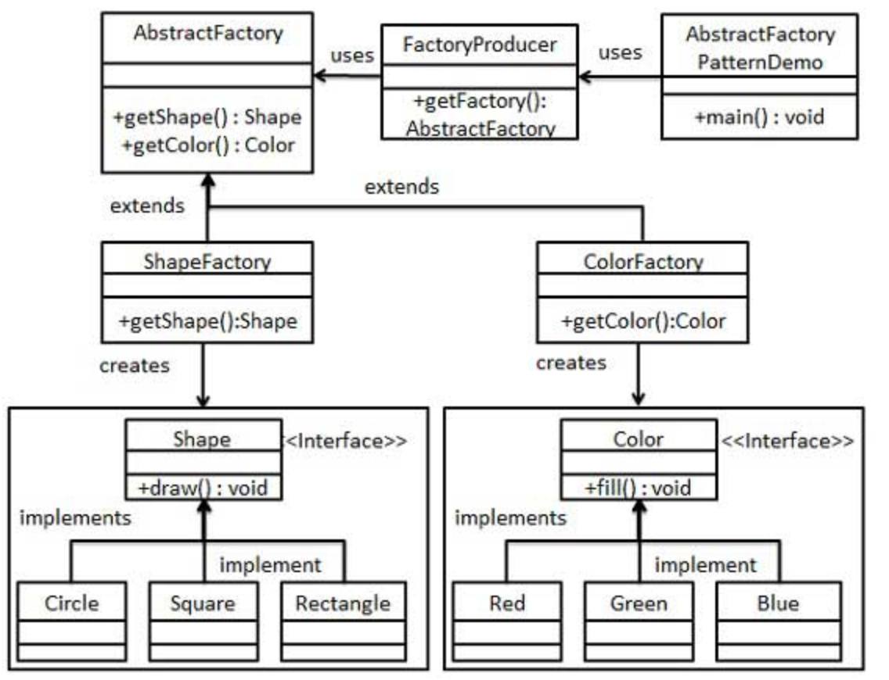

### **一、抽象工厂模式**

抽象工厂模式（Abstract Factory Pattern）是围绕一个超级工厂创建其他工厂。该超级工厂又称为其他工厂的工厂。这种类型的设计模式属于创建型模式，它提供了一种创建对象的最佳方式。

在抽象工厂模式中，接口是负责创建一个相关对象的工厂，不需要显式指定它们的类。每个生成的工厂都能按照工厂模式提供对象。

### **二、介绍**

意图：提供一个创建一系列相关或相互依赖对象的接口，而无需指定它们具体的类。

主要解决：主要解决接口选择的问题。

何时使用：系统的产品有多于一个的产品族，而系统只消费其中某一族的产品。

如何解决：在一个产品族里面，定义多个产品。

关键代码：在一个工厂里聚合多个同类产品。

优点：当一个产品族中的多个对象被设计成一起工作时，它能保证客户端始终只使用同一个产品族中的对象。

缺点：产品族扩展非常困难，要增加一个系列的某一产品，既要在抽象的 Creator 里加代码，又要在具体的里面加代码。

### **三、实现**



#### **3.1、为形状创建一个接口。**

```java
public interface Shape {
   void draw();
}
```

#### **3.2、创建实现接口的实体类**

```java
public class Rectangle implements Shape {

   @Override
   public void draw() {
      System.out.println("Inside Rectangle::draw() method.");
   }
}
```

```java
public class Square implements Shape {

   @Override
   public void draw() {
      System.out.println("Inside Square::draw() method.");
   }
}
```

```java
public class Circle implements Shape {

   @Override
   public void draw() {
      System.out.println("Inside Circle::draw() method.");
   }
}
```

#### **3.3、为颜色创建一个接口**

```java
public interface Color {
   void fill();
}
```

#### **3.4、创建实现接口的实体类**

```java
public class Red implements Color {

   @Override
   public void fill() {
      System.out.println("Inside Red::fill() method.");
   }
}
```

```java
public class Green implements Color {

   @Override
   public void fill() {
      System.out.println("Inside Green::fill() method.");
   }
}
```

```java
public class Blue implements Color {

   @Override
   public void fill() {
      System.out.println("Inside Blue::fill() method.");
   }
}
```

#### **3.5、为 Color 和 Shape 对象创建抽象类来获取工厂**

```java
public abstract class AbstractFactory {
   public abstract Color getColor(String color);
   public abstract Shape getShape(String shape) ;
}
```

#### **3.6、扩展工厂类**

```java
public class ShapeFactory extends AbstractFactory {
       
   @Override
   public Shape getShape(String shapeType){
      if(shapeType == null){
         return null;
      }        
      if(shapeType.equalsIgnoreCase("CIRCLE")){
         return new Circle();
      } else if(shapeType.equalsIgnoreCase("RECTANGLE")){
         return new Rectangle();
      } else if(shapeType.equalsIgnoreCase("SQUARE")){
         return new Square();
      }
      return null;
   }
   
   @Override
   public Color getColor(String color) {
      return null;
   }
}
```

```java
public class ColorFactory extends AbstractFactory {
       
   @Override
   public Shape getShape(String shapeType){
      return null;
   }
   
   @Override
   public Color getColor(String color) {
      if(color == null){
         return null;
      }        
      if(color.equalsIgnoreCase("RED")){
         return new Red();
      } else if(color.equalsIgnoreCase("GREEN")){
         return new Green();
      } else if(color.equalsIgnoreCase("BLUE")){
         return new Blue();
      }
      return null;
   }
}
```

#### **3.7、创建工厂生成器**

```java
public class FactoryProducer {
   public static AbstractFactory getFactory(String choice){
      if(choice.equalsIgnoreCase("SHAPE")){
         return new ShapeFactory();
      } else if(choice.equalsIgnoreCase("COLOR")){
         return new ColorFactory();
      }
      return null;
   }
}
```

#### **3.8、测试**

```java
public class AbstractFactoryPatternDemo {
   public static void main(String[] args) {

      //获取形状工厂
      AbstractFactory shapeFactory = FactoryProducer.getFactory("SHAPE");

      //获取形状为 Circle 的对象
      Shape shape1 = shapeFactory.getShape("CIRCLE");

      //调用 Circle 的 draw 方法
      shape1.draw();

      //获取形状为 Rectangle 的对象
      Shape shape2 = shapeFactory.getShape("RECTANGLE");

      //调用 Rectangle 的 draw 方法
      shape2.draw();
     
      //获取形状为 Square 的对象
      Shape shape3 = shapeFactory.getShape("SQUARE");

      //调用 Square 的 draw 方法
      shape3.draw();

      //获取颜色工厂
      AbstractFactory colorFactory = FactoryProducer.getFactory("COLOR");

      //获取颜色为 Red 的对象
      Color color1 = colorFactory.getColor("RED");

      //调用 Red 的 fill 方法
      color1.fill();

      //获取颜色为 Green 的对象
      Color color2 = colorFactory.getColor("Green");

      //调用 Green 的 fill 方法
      color2.fill();

      //获取颜色为 Blue 的对象
      Color color3 = colorFactory.getColor("BLUE");

      //调用 Blue 的 fill 方法
      color3.fill();
   }
}
```