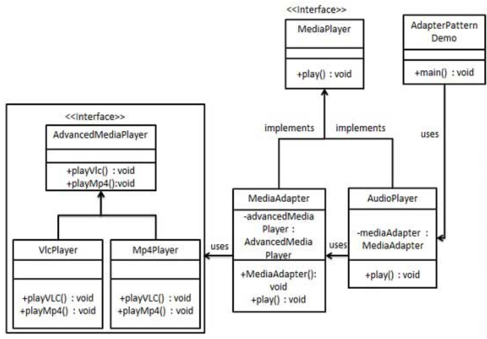

### **一、适配器模式**

适配器模式（Adapter Pattern）是作为两个不兼容的接口之间的桥梁。

这种模式涉及到一个单一的类，该类负责加入独立的或不兼容的接口功能。读卡器是作为内存卡和笔记本之间的适配器，将内存卡插入读卡器，再将读卡器插入笔记本，这样就可以通过笔记本来读取内存卡。

### **二、介绍**

**意图：**将一个类的接口转换成客户希望的另外一个接口。适配器模式使得原本由于接口不兼容而不能一起工作的那些类可以一起工作。

**主要解决：**主要解决在软件系统中，常常要将一些"现存的对象"放到新的环境中，而新环境要求的接口是现对象不能满足的。

**何时使用：** 

1. 系统需要使用现有的类，而此类的接口不符合系统的需要。 

2. 想要建立一个可以重复使用的类，用于与一些彼此之间没有太大关联的一些类，包括一些可能在将来引进的类一起工作。 

3. 通过接口转换，将一个类插入另一个类系中。（比如老虎和飞禽，现在多了一个飞虎，在不增加实体的需求下，增加一个适配器，在里面包容一个虎对象，实现飞的接口。）

**如何解决：**继承或依赖。

**关键代码：**适配器继承或依赖已有的对象，实现想要的目标接口。

**应用实例：**

1. 美国电器 110V，中国 220V，就要有一个适配器将 110V 转化为 220V。 

2. 在 LINUX 上运行 WINDOWS 程序。 

**优点：**

1. 可以让任何两个没有关联的类一起运行。 

2. 提高了类的复用。 

3. 增加了类的透明度。 

4. 灵活性好。

**缺点：** 

1. 过多地使用适配器，会让系统非常零乱，不易整体进行把握。

2. 由于 JAVA 至多继承一个类，所以至多只能适配一个适配者类，而且目标类必须是抽象类。

**使用场景：**有动机地修改一个正常运行的系统的接口，这时应该考虑使用适配器模式。

### **三、实现**



#### **3.1、为媒体播放器和更高级的媒体播放器创建接口**

```java
public interface MediaPlayer {
   public void play(String audioType, String fileName);
}
```

```java
public interface AdvancedMediaPlayer { 
   public void playVlc(String fileName);
   public void playMp4(String fileName);
}
```

#### **3.2、创建实现了 AdvancedMediaPlayer 接口的实体类**

```java
public class VlcPlayer implements AdvancedMediaPlayer{
   @Override
   public void playVlc(String fileName) {
      System.out.println("Playing vlc file. Name: "+ fileName);      
   }
 
   @Override
   public void playMp4(String fileName) {
      //什么也不做
   }
}
```

```java
public class Mp4Player implements AdvancedMediaPlayer{
 
   @Override
   public void playVlc(String fileName) {
      //什么也不做
   }
 
   @Override
   public void playMp4(String fileName) {
      System.out.println("Playing mp4 file. Name: "+ fileName);      
   }
}
```

#### **3.3、创建实现了 MediaPlayer 接口的适配器类**

```java
public class MediaAdapter implements MediaPlayer {
 
   AdvancedMediaPlayer advancedMusicPlayer;
 
   public MediaAdapter(String audioType){
      if(audioType.equalsIgnoreCase("vlc") ){
         advancedMusicPlayer = new VlcPlayer();       
      } else if (audioType.equalsIgnoreCase("mp4")){
         advancedMusicPlayer = new Mp4Player();
      }  
   }
 
   @Override
   public void play(String audioType, String fileName) {
      if(audioType.equalsIgnoreCase("vlc")){
         advancedMusicPlayer.playVlc(fileName);
      }else if(audioType.equalsIgnoreCase("mp4")){
         advancedMusicPlayer.playMp4(fileName);
      }
   }
}
```

#### **3.4、创建实现了 MediaPlayer 接口的实体类**

```java
public class AudioPlayer implements MediaPlayer {
   MediaAdapter mediaAdapter; 
 
   @Override
   public void play(String audioType, String fileName) {    
 
      //播放 mp3 音乐文件的内置支持
      if(audioType.equalsIgnoreCase("mp3")){
         System.out.println("Playing mp3 file. Name: "+ fileName);         
      } 
      //mediaAdapter 提供了播放其他文件格式的支持
      else if(audioType.equalsIgnoreCase("vlc") 
         || audioType.equalsIgnoreCase("mp4")){
         mediaAdapter = new MediaAdapter(audioType);
         mediaAdapter.play(audioType, fileName);
      }
      else{
         System.out.println("Invalid media. "+
            audioType + " format not supported");
      }
   }   
}
```

#### **3.5、使用 AudioPlayer 来播放不同类型的音频格式**

使用 AudioPlayer 来播放不同类型的音频格式。

```java
public class AdapterPatternDemo {
   public static void main(String[] args) {
      AudioPlayer audioPlayer = new AudioPlayer();
 
      audioPlayer.play("mp3", "beyond the horizon.mp3");
      audioPlayer.play("mp4", "alone.mp4");
      audioPlayer.play("vlc", "far far away.vlc");
      audioPlayer.play("avi", "mind me.avi");
   }
}
```